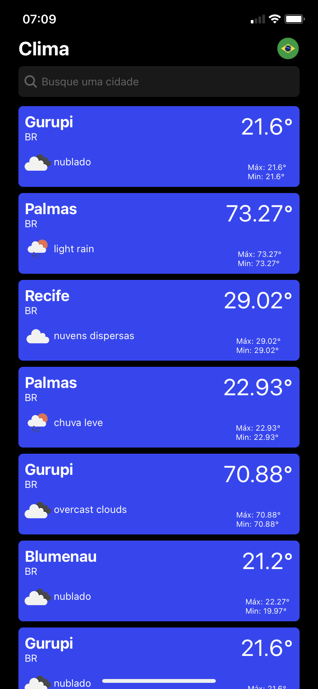
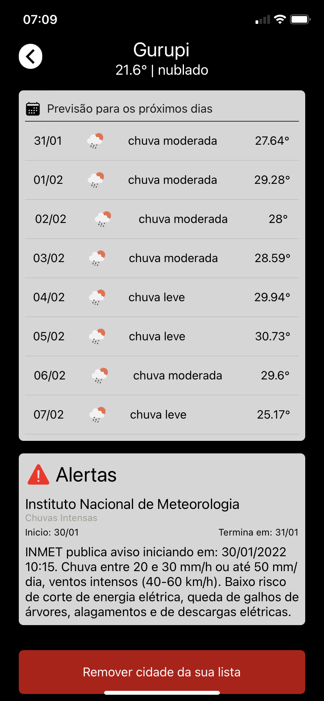
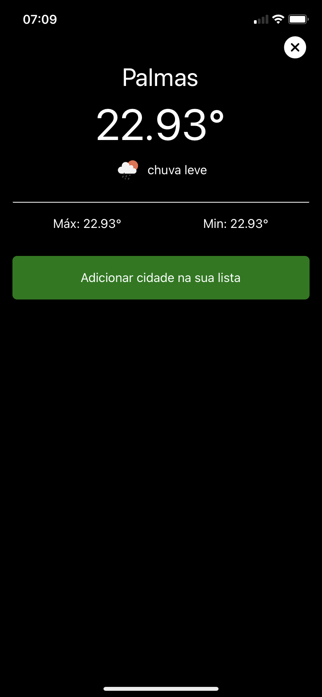

<h1 align="center">
    Weather Filipe
</h1>
 

Weather Filipe tem o objetivo de ser um app para vizualizar a condição climática de determinadas regiões

<h4 align="center">
  ☀Weather Filipe
</h4>

Telas do App

    
    
    

## :rocket: Tecnologias

Esse projeto foi desenvolvido com as seguintes tecnologias:

- [React Native](https://facebook.github.io/react-native/)

## 💻 Projeto

App para controle de ações da minha carteira de investimentos

## 🤔 Como contribuir

- Faça um fork desse repositório;
- Cria uma branch com a sua feature: `git checkout -b minha-feature`;
- Faça commit das suas alterações: `git commit -m 'feat: Minha nova feature'`;
- Faça push para a sua branch: `git push origin minha-feature`.

Depois que o merge da sua pull request for feito, você pode deletar a sua branch.
